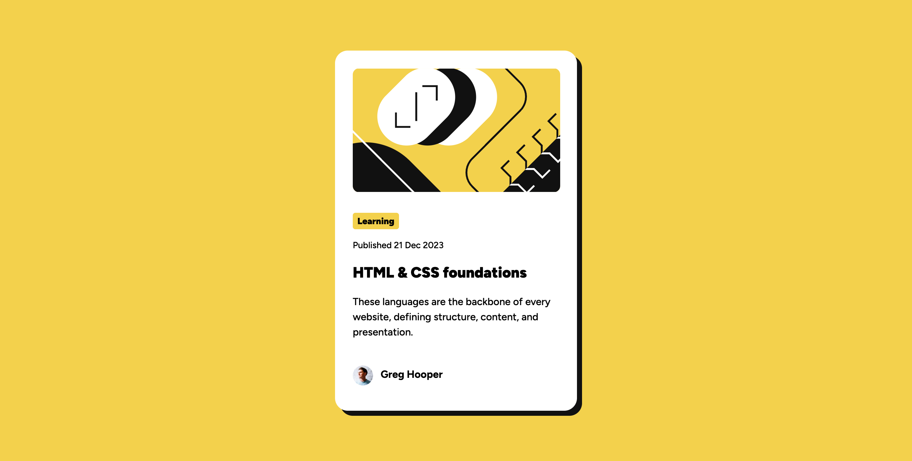

# Frontend Mentor - Blog preview card solution

This is a solution to the [Blog preview card challenge on Frontend Mentor](https://www.frontendmentor.io/challenges/blog-preview-card-ckPaj01IcS). Frontend Mentor challenges help you improve your coding skills by building realistic projects.

## Table of contents

- [Overview](#overview)
  - [The challenge](#the-challenge)
  - [Screenshot](#screenshot)
  - [Links](#links)
- [My process](#my-process)
  - [Built with](#built-with)
  - [What I learned](#what-i-learned)
  - [Continued development](#continued-development)
  - [Useful resources](#useful-resources)
- [Author](#author)

## Overview

### The challenge

Users should be able to:

- See hover and focus states for all interactive elements on the page

### Screenshot

### Links

- Solution URL: [Solution](https://www.frontendmentor.io/solutions/blog-card-mobile-first-flexbox-css-variables-GdiLA4fPPm)
- Live Site URL: [Live Site](https://txubi.github.io/FEM-BlogCard/)

## My process

Had to google how to make the avatar image center before the author's name.

### Built with

- Semantic HTML5 markup
- CSS custom properties
- Flexbox
- Mobile-first workflow

### What I learned

I learned how to use rem units to make the transition from mobile to desktop viewports easier. I also learned how to use the ::before element to make images instead of content. The comments "? yolo" in the css were written when I eyeballed things. I have to learn to dissect figma files better.

### Continued development

I didn't know if I was supposed to use an a instead of an h1. I didn't know how to approach making a link look like an h1 without compromising accessibility concerns. I will look into this more.

### Useful resources

- [Google](https://www.google.com) - lol

## Author

- Jon Avila
- Frontend Mentor - [@txubi](https://www.frontendmentor.io/profile/txubi)
